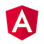
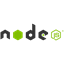

CPT 111

Assignment 3

Part 1

LateJoiners
Tip Plus+

Luke Warren
Matt Greig
Blair Fraser
Tyrone Cook
Shae Tatlock

\pagebreak

### Project Background

#### Motivation
Right from the outset, ideas were thrown into the mix, via an **ideas** channel on our Slack team. These included potential options such as:
- a school math education app, grocery/shopping list app
- medication schedule and records app
- fantasy sports, etc.

But the timing of the imminent World Cup provided the final inspiration for a 'sports tournament tipping' application where users could submit their predictions and measure the success or failure of their prescience against other users.

#### The LateJoiners Team

**Luke Warren** (s3409172@student.rmit.edu.au)

Luke was the leader of the LateJoiners team. As an experience Web Developer based in South Africa, Luke was able to lead from the front in implementing the MEAN stack and providing the foundation on which our application was developed. This project was an opportunity to employ paradigms of Continuous Delivery, and a chance to implement this functionality himself.

**Matt Greig** (s3439728@student.rmit.edu.au)

After Luke, Matt was probably the next most experienced team member with regards to course progress and exisiting skillset. When the time difference caused complications, Matt acted as team leader to facilitate catchups as well as record and distribute notes from meetings. Additionally, Matt contributed to the documentation that was authored during this project.

**Blair Fraser** (s3641830@student.rmit.edu.au)

Blair took the lead with providing the peer feedback on behalf of our team. As a capable author and developer he adapted his existing scripting-language skills with Python, to the web stack implemented for this project. Additionally, Blair worked effectively to produce the collated design plan for our application.

**Tyrone Cook** (s3731802@student.rmit.edu.au)

Tyrone worked efficiently to develop his skills to contribute to the development of this application. Many facets of this process provided valuable first-time experience with the Web Development stack and associated processes. He also worked earnestly, with a lot of contributions to the documentation requirements of the unit.

**Shae Tatlock** (s3655740@student.rmit.edu.au)

Shae was certainly the most design-centric member of the team. He led the research and investigation of the styling framework we were to implement along with the colour palette; collating a style-guide to define the application's visual interface.

#### Aims and Goals
##### Aim

Our intention was to create a functioning Web Application that allows authenticated users to compete in tournaments by submitting their predictions for the results of real-world sporting fixtures. This is not a *betting* application; there are no monetary rewards for participation in this application. Measuring your skill and knowledge against other users is the real reward of Tip Plus.

##### Goal #1
**Create an application using a MEAN stack**

Of the variety of development stack's available for authoring Web Applications, the **Mongo-Express-Angular-Node** stack is one of the more popular variants employed.

Mongo provides a (relatively) schema-less database that doesn't require team-members to be familiar or experienced with SQL. Instead it allows for beginner users to visually inspect database entries for validity and to become familiar with integration with a database. Node provides a Javascript back-end which is advantageous to team members who have at least some experience with this language, as opposed to other back-end languages such as Java, Python or PHP. It keeps the application contained within a single dialect. Angular is the powerful framework that provides tools for two-way data-binding and dynamic page creation that will allow our application to appear fluid and interactive. Altogether, this stack is both gentler on entry-level users, while providing the components necessary to deliver a fully-featured application.

##### Goal #2
**Implement a responsive application styled with the Bootstrap framework**

Bootstrap is a widely implemented and actively developed stylesheet framework which has the added benefit of providing very useful tools to develop responsive websites for multiple viewing platforms. As well as providing useful handlers for responsiveness, the existing stylings for interactive features such as buttons, tabs, navigation bars and the like, provide an out-of-the-box advantage when prototyping the site, right through to final deployment. Experience with Bootstrap would be valuable addition to each of the team member's CV's and this application provides a perfect scenario with which each team-member can gain valuable experience.

##### Goal #3
**Implement a Continuous Integration (CI) build system which would test and validate code merged from each of the different team collaborators**

This CI system would provide an automated testing suite, preventing any code changes that break the build of the application from being merged into the production codebase or worse, being deployed into the live application.

A CI process would allow *developing* developers to work on a branch of the existing production codebase and operate with the confidence that they cannot corrupt a live application.

##### Scope
The TipPlus was designed and developed with the following scope considerations:

- be responsive
	- the same codebase can serve the application of mobile devices as well as in desktop browsers.
- be dynamic
  - using Angular and data-binding, allow the application to adapt quickly, and customised to user-interaction
- source up-to-the-minute, live data from public APIs
  - using a multitude of available APIs we aim to provide a variety of sporting tournaments and leagues from around the world
- support multiple concurrent, authenticated users

### Project Progress

#### Description
Once our group was mostly formed, we began brainstorming ideas for what our web application would be based around. The idea to make our project a web app being the initiative of team leader Luke. After a short period discussing our preferences, the group had unanimously agreed on making a web app for tipping on the World Cup, given its popularity and relevance at the time. Shortly after this decision had been made however, we had realised that by the time our project was fully completed the World Cup would be well and truly over making our World Cup tipping web app to become redundant from the start. It was at this point where we decided to change our focus from the World Cup to a more general tipping web app. From this point, our project never drastically deviated from our aims.

#### Outcomes to Date
For our project, we have mockups of each web page that is accessible to the user of our tipping app.
This includes:

- A login screen, which also features a mockup for input validation when the user makes an error logging in.

- A reset password screen reached from the login screen, also coming with a mockup for input validation for when the user makes an error entering their email.

- An account page which features the users details, with a mockup of when a user decides to update their email.

- The page listing all sports with their leagues that are available to tip for.

- The page where users enter their tips, including a mockup for input validation where the user fails to enter a tip for 1 or more games.

- The results page where users can see the results from the previous week of their chosen league.

Current components of the Application that are developed and undergoing additional refinement:

- Front and Backend models for relevant data, ie. matches, rounds, results

- CI build testing and deployment

- Server and Client-side components deployed to Heroku and Netlify, respectively

- Alternative Data Sources

- Login and Registration pages

- Tournament Selection

- Pre-round fixtures

#### Scope Creep or Scope Contraction

*“The life of every man is a diary in which he means to write one story, and writes another; and his humblest hour is when he compares the volume as it is with what he vowed to make it.”*
-- JM Barrie

The initial motivation for the application was a single sporting tournament, the World Cup. As we looked at comparable sites and investigated the plethora of applications with similar functionality, it became clear that the sustainability of such an application involved exposure to an audience wider than that of a single sport, let alone a single tournament of that sport (even if it is the largest quadrennial sporting tournament outside of the Olympics). Without extensive investigation we undertook to add multi-sport, multi-tournament capabilities to the functions of our application.

Out susceptibility to this was multi-fold. Early on, we were convinced, falsely or not, that there would be an *api-for-all*. This would provide us with endless possibilities as long as we kept our data models abstract enough. This soon proved to be harder than initially considered as most APIs were going to require a monetary subscription in order to maintain a stream of consistent and quality data with which to populate the application.

Additionally our limited experience; with only one member truly capable of authoring all components of the stack, plus the time-poor nature of study when combined with full-time work and other extra-curricular responsibilities (ie. family) meant that the time required to even develop and maintain the framework of the application was going to occupy almost exclusively the schedule for development, outside of the documentation requirements for assessment, let alone investigate, source and curate data sources for a multitude of sports and events.

#### Progress

Honestly, our adherence to our schedule was spotty at best. Early on we mapped out our perceived development phases into a series of sprints; assigning tasks and milestones. As we progressed and began to fall behind schedule, we began to re-deploy tasks back to later and later sprints. This has the follow-on effect of delaying a lot of the Application's key implementations to very late in our schedule, during a time that originally been intended for a lot of testing, bug fixing and final polishing.

Resulting from this was a lot of discussion and reflection on our original schedule and whether it was either realistic from the outset, or whether it relied on a lot of good fortune and optimistic progress in the development of the necessary skills to develop the application.

#### Testing
Early on, during development of the stack and initial formation of the application, Luke initiated an automated build-testing system using [CircleCI](https://circleci.com) which would be triggered upon commits pushed back to the hosted repository.

A suite of tests to validate both the front and back end components of the application was developed and deployed. Client side testing includes:
- unit testing with Karma
- end-to-end testing with Protractor

Server-sider testing includes:
- Node Package Manager (npm)
- Linter testing via npm

#### Tools and Technologies

##### The Stack

M-E-A-N

**[Mongo](https://www.mongodb.com)** *the database*

Mongo is a free, open-source database, classified as a NoSQL database. It stores data using a JSON-styled schema, and this was one of the primary motivations for selecting this as our database for this application. The schema allows for easy inspection and validation, with a lower barrier-to-entry than some more robust, SQL-style databases. An additional advantage is the array of JavaScript frameworks that integrate with Mongo as well as an extensive and active developer community that is constantly refining and enhancing this product.

**[Express](https://expressjs.com)** *the URL responder*

Speaking of which, ExpressJS is a Node module that manages route support; allowing for custom responses to specific URLs.

**[Angular](https://angular.io)** *the Web Application builder and engine*

Angular is the ground-up rewrite of AngularJS, the application framework originally developed at Google. In it's own words, Angular "combines declarative templates, dependency injection, end to end tooling, and integrated best practices to solve development challenges. Angular empowers developers to build applications that live on the web, mobile, or the desktop".

Angular is widely used, with additional bindings to companion frameworks (ie. Bootstrap) having been also developed and released. The use of components, along with two-way data binding facilitates the development of powerful, dynamic Web Applications, such as the one we are actively developing.

**[NodeJS](https://nodejs.org/en/)** *the back-end*

NodeJS is a run-time environment to facilitate execution of applications written in Javascript. It's designed to be event-driven and non-blocking, which makes it ideally suited to handling I/O requests.

It has been extended by one of the largest library of third-party modules, managed by its own package manager, NPM.

The key advantage of Node is it's written in Javascript; enabling the server-side code to be written in the same dialect as the front-end, and eliminating the need for experience with additional server-side languages such as Java, Python or PHP.

##### Additional Frameworks
**[Bootstrap](https://getbootstrap.com)** *the responsive styling framework*

Bootstrap is one of the most popular responsive styling frameworks; developed by Twitter and since released as an open-source project. It contains many templates to provide out-of-the-box styling for forms, buttons, tables, navigation and much more.

Bootstrap employs a grid system of rows and columns which makes relative sizing and formatting much simpler to define.

##### Support

**[git](https://git-scm.com)** *version control system*

git is the version control system (VCS) *de rigeur* these days. A couple of team members had moderately-extensive experience with git, prior to undertaking the unit, while others were relatively novice, or altogether unexperienced. It was immediately recognised that git could serve as a VCS, not just for our codebase, but also for all the documentation that was to be a requirement of the project. This would have the additional benefit of providing practical exposure to those team members with minimal experience as well as facilitating collaborative development via the use of cloned local repositories and branches.

All documentation for the project (including this one) was maintained under version control in a git repository.

**[github](https:///www.github.com)** *hosted git repository*

As git is to the development community, so github is to hosted git repositories. Github allows for easy server-side hosting of a git repository, with easy authentication (coupled with the free student accounts we are eligible for), it made for a de-centralised hosting service which provides reliable up-time.

On github, within our team, we hosted two repositories. One for the code of the application we are developing, and another for the documentation.

Team members managed the repository in several ways. Some users were comfortable enough to use the command-line interface (CLI), while others used third-party applications like [GitKracken](https://www.gitkraken.com).

Github accounts were also useful, in allowing us to integrate additional platforms without requiring additional account signups (see below for CircleCI).

Github also makes it easy to view contribution reports, with an extensive array or reporting and profiling, allowing easy access to the raw data of commits and contributions by the different team members.

**[circleci](https://www.circleci.com)** *automated testing and deployment host*

CircleCI is a development pipeline automation platform. It integrates with our VCS repository(s) and is configurable to perform a defined suite of builds and tests, with notifications for success or failure, along with deployment to our hosting platform(s).

Luke took time early on, to configure CircleCI for us in order to allow for *Continuous integration* of our application, with the aforementioned alerts for conflicts or failed builds tied into the notification system for our Slack Team via integration with the CircleCI application for Slack.

**[maid](https://github.com/egoist/maid)** *live testing script as documentation*

Maid is a Node module that allows the definition of a series of tasks to be performed, as a Markdown file! By using the Markdown syntax to distinguish between blocks of code to be executed, and common, descriptive text, a Maid file can operate both as an executable script and documentation at the same time!

**[Slack](https://slack.com)** *real-time chat and collaboration platform*

Slack is one of the more powerful group collaboration tools currently in the market. It is available on multiple platforms, from Desktop to Browser, to mobile environments like iOS and Android. We decided on Slack for this purpose; it would allow team members to be accessible from multiple platforms, and by enabling notifications, hopefully would allow for communications without too much delay.

Slack allows for the creation of channels; topic-specific 'rooms' which allow us to segregate different elements of discussion throughout the course of development, without flooding a single, "main" channel. Slack adheres to the direct-notification convention, allowing a user to at ('@') another user in a public channel in order to attract their specific attention to a message.

The ability to directly communicate in privacy between users allows communications to be more focussed, allowing potentially sensitive discussion to conducted discretely, as well as also serving to keep main channels free of more direct chatter.

An added power with Slack is the extensive marketplace of integrations from common applications, including some already mentioned. We were able to extend Slack by integrating our Github repository and CircleCI project, to allow for notifications related to those two platforms to be published to our Slack team, as well as Google Hangouts integration in order to commence group chats.

**[trello](https://www.trello.com)** *collaborative project and task management system*

Trello is a task-tracking and management application, which was a compulsory requirement of the unit. Trello tracks tasks using a *virtual note card* system which allows specific tasks to be isolated to a single card, which are in turn collated with related tasks into user-defined groups, named *boards*.

Boards and Cards were used to assign team members to specific tasks, as well as being a place to publicly post links and media amongst the team.

Our team Trello board was used primarily as a means of tracking for our unit mentor, allowing them to view our own delegation of tasks, as well as adding their own in order to promote progress and development.

**[google hangouts](https://hangouts.google.com)** *group video-chat platform*

Google Hangouts was available to our team without effort due to the Google Suite backbone for RMIT email. Installing the hangouts [integration](link) with Slack, we were able to initiate hangouts directly from the Slack interface. A product of this process was to broadcast a notification to channel members of the hangout, with an easy link for members to click-to-join.

Google Hangouts were used throughout the development process for both our weekly mentor catchups, and our weekly team catchups. Using video conferencing helped build team cameraderie and familiarity, which was effective given our team were all strangers to each other at the beginning of the project.

**[heroku](https://www.heroku.com)** *backend hosting*

Heroku is a cloud-based platform that facilitates deployment and monitoring of Web Applications.

Luke configured a Dyno (a virtualised Linux container in Heroku parlance) that contained our Node.js server which could be spun-up on demand. Our application was light enough that we were able to take advantage of the free tier for our purposes, with no cost incurred.

Heroku features integration with CircleCI, allowing for swift deployment of successful builds to the Dyno.

**[netlify](https://www.netlify.com)** *client-side hosting*

Netlify is a web-hosting platform somewhat akin to github pages in that it can take deployment straight from a git repository. It hosts the client-side portion of our application.

##### Additional

A variety of IDEs were used by the team:
- Visual Studio Code
- WebStorm
- Atom
- MS Word

### Challenges and Learning

*“In preparing for battle I have always found that plans are useless, but planning is indispensable.”*
― Dwight D. Eisenhower

#### What's been easy?

It goes without saying, that this assignment has been a learning experience for each member of the team. We all entered this project with a variety of experience, both practically with respect to capabilities with the technologies involved, and academically; with the some members having a few units under their belt, and others being a few units shy of completion. Polling the team to reflect on the experience of producing this application has yielded some interesting retrospection.

Many found the Tools and Technologies employed to be either familiar enough, or with an easy enough barrier-to-entry. Working with a centralised Version Control System (VCS) for the documentation components of the assessment, as well as the codebase, provided a transparent and manageable approach to collaboration.

Conceiving the concept and potential of the application was also appreciably simple enough. Early enthusiasm certainly drove inspiration, and *on paper* the gestation and potential of the application was actively developed.

#### Difficulties
If conception and gestation was simple enough; development, when the time came, was where the project hit the skids. The proposed stack (MEAN) while initially met with enthusiasm for potential of practical experience with a new but prevalent collection of frameworks, was soon discovered to be a steep obstacle. For some, it was not just the stack, but the additional technologies of hosting-platforms, continuous integration and styling frameworks (Bootstrap) that added to the knowledge gap. Suddenly, what was easy enough to conceive in design, was proving more ominous to develop.

That said, each team member was realistic about their own skill levels and learning abilities; the need to embrace a new technology was not unexpected. In fact, there were occasions where members discovered with further research and discovery, that what they'd anticipated as potentially foreboding (noSQL databases for example) actually revealed themselves as much less intimidating as anticipated. Other members were able to parlay some existing experience or familiarity with comparable platforms such as Django, and adapt concepts of templating and routing from Python to Angular. Recognising early-on, that self-learning was going to be paramount to meeting the challenge of this project, team members were quick to share experiences and knowledge, as well as links to recommended and beneficial tutorials. In fact, a #stack-questions channel was created in our Slack team for this very purpose. All of this, coupled with some *on-the-fly* tutorials from our team leader Luke, progressed our knowledge and experience with this new stack.

Some team members found their study patterns were not immediately coherent with group work. With the group attempting to adhere to a schedule involving *at least* weekly meetings via Hangouts, as well as the additional mentor meetings; adapting a study schedule, including both advance study of frameworks and technologies, as well as completing interim contributions to active assignments (ie. 1 and 2) meant a refactoring of study patterns that were already ingrained.

Additionally, we had one team member who was in a timezone eight hours behind the bulk of the rest of the team (whose other chronologically unsynchronised team member was +2 hours behind). This was occasionally problematic for meetings, which when scheduled for 2000 Australian Eastern Time, fell at 1200, and in the middle of a work-day for them. There were occasions when they were unable to attend due to work conflicts, or inability to secure a private space with which to conduct a video conference with the rest of the team. Fortunately, the mentor-hangouts were recorded and available for viewing after-the-fact, and we endeavoured to keep in constant communication regarding meeting outcomes via distribution of minutes, as well as posting meeting review notes to the Slack team.

Out of this all, each team member has come away more confident in their skills and capabilities with the technologies involved. The value of this experience has not been lost on the team. This project has provided valuable, practical exposure to industry-standard skillsets such as version control with git and server-based repositories with Github, the Angular and Node frameworks, nonSQL databases with Mongo, as well as developing skills with Javascript and an introduction to Typescript. For some this was the first opportunity to employ Bootstrap, and work first-hand with a responsive design framework, including working with the bindings developed specifically for Angular. And for others, this was the opportunity to employ processes typically implemented or managed by a different portion of the engineering team; implementing a test suite as well as continuous integration and delivery services.

**Reflections**

A commonality amongst all team members is a confession of naivety, of one form or another. We each entered this project with pre-conceived notions regarding our own capabilities, and as we now look back on this unit and the development of our web application, we are not afraid to confess to being humbled; our intentions having met with reality.

Where we initially considered that each member would bring his own quality and capacity, and to an extent *own* a component of the application, it was soon evident that this dissection of responsibilities was not going to result in success. Each member has to adapt and share responsibilities *across* capacities within this project. Where one member, whose strength was more favoured to design, soon realised that successfully implementing design with regards to component templates within Angular, would require the ability to ingest and modify data from an external datasource.

As the project progressed, it was soon obvious that there were deficiencies in the tutorials we had completed. Many of them focussed on the individual components of the stack, with little development of how Angular would interact in relation to Node, Express or Mongo via Mongoose. As such, we were soon made aware that we couldn't rely purely on tutorials that focussed (mostly) exclusively with an individual platform; we would need to explore how the platforms worked together. Fortunately, during this process, the experience of Luke enabled him to progress on the backend components, the skeleton on which the application was to be fleshed out, allowing those of us coming up to speed, the time to gain enough proficiency to commence development in earnest.

We were soon made keenly aware of the difficulty in sourcing data to populate the application. There was not a simple *one-firehose-for-all* which would readily provide a stream of sporting data which we could purpose for the app. We began to realise where our expectations and intentions were stretched, and began to pare back the functionality to more reasonable expectations.  

In hindsight, our initial proposal and specification for the application should have been more modest, earnest and ultimately, achievable. It was not until we were well underway in the unit, when the realisation was made, that the significant component of this unit was the *process* of developing the application, not the application itself. We had misinterpeted the requirements as being more focussed on the *ends* rather than, as became obvious, the *means*. Aiming for a simpler, yet perhaps more robust application, would have made for a more manageable process which was accessible to the wide variety of skill levels of the team members. As one team member expressed, it would have allowed us to concentrate on a smaller, more concentrated group of technologies with less variables affecting the potential for things to go wrong. This potential over-reach was reflected in 60%-40% division amongst the five members of our team, where the majority felt that the timetable we developed for ourselves was **not** realistic. This was not aided by the admission by members that, in the end, external factors; a work promotion resulting in greater responsibility, changed accommodation circumstances, *moving* residence, changed deadlines on work projects, managing four young kids... were the tipping point that made an already stretched schedule, even more difficult to adhere to. To this end, almost all the risks that materialised in the course of this project were attributable to either the steep-learning curve that delayed commencement on the application as originally scheduled, or the unforeseen nature of life interfering with the attention required of the project, often at the most inconvenient times.

However, a positive response was given to the tools and technologies we employed in the development of this application. There was an almost unanimous agreement that the tools employed for this application were all correctly chosen and worth adopting again in future. General communications in Slack, task management in Trello, a shared repo in Github, and Google Hangouts for catchups with the team and with our mentor, were common points that worked irrespective of Operating System, platform or personal preference of IDE.

### Project Processes
#### What's been learned about group projects?
The first thing we have learned about group projects is there needs to be a diverse range of individual personalities and skill levels in the group. A lack of differing backgrounds and opinions can lead to groupthink which is not helpful and even detrimental to the group project.

Also, time management and group deadlines for tasks for each active member are vital to keeping the group moving forward together towards a common goal. If even a single member fails to complete whats expected that was part of the group plan for a larger critical task, the project can become much harder than it needs to be.

We've learned that communication is essential to completing any groupwork. Regular meetings plus relevant updates from each member about what they are working on or completed lets everybody in the group know where the group is currently at in terms of progress, and if required lets the more experienced members of the group assist the junior members of the group learning if they are having trouble with a particular task or concept.

#### What were the group's processes for communication?

Regular, scheduled checkins were mandatory for all group members, to ensure the whole group was on the same page and aware of the short and long term requirements both individually and for the group as a whole. Inevitably, there were occasions where group members were unable to attend a group meeting; given that a couple of team members reside in different time zones, and reason for part-time study is due to existing, unavoidable commitments. Ideally, it was considered appropriate for team members to notify in advance of their unavailability for meetings; the onus remaining with them to catch up with any outcomes or action points resulting from the meeting, whether via group communication, reading the meeting notes or viewing a recording of the hangout.

The team used Slack for group messaging, using it's notifications feature for instant messaging and updates. If any member needed to contact a fellow member or the group as a whole, they were able to do so via individual or team channels on Slack. Group members were also able to update the group on their progress on whatever tasks they were completing, or ask fellow group members for assistance in certain areas of their work they felt uncomfortable or not familiar with. To get the most out of Slack, each member was required to enable notifications. This method of communication for the group was an easy and fast way to keep the up to date on most things related to the project.

#### From your experience in this project, what is the most important aspect of organizing a project of this nature?
The most important aspect of organizing this type of project is the need for a variety of individuals and personalities in your group, including a distribution of experience and skills. A variety in skill level ensures that there is no confusion as to each members role in the group. The more experienced members take the more senior leader roles, with the less experienced intended to learn from them.

With this type of project there were tasks requiring different skills; whether it be coding the front or back-end, writing reports, creating mockup pages or just experience leading teams of people. Having at least one member familiar with a certain topic, or familiar with the tools and technology required to complete a certain topic, was crucial to completing each task without danger. They could either achieve what was required by the group on their own, or if the workload required, teach the group how to accomplish and complete the specific task.

#### What advice would you give...?
The best advice that can be passed on, from our collective experience is to be active in development, earnest in conviction and avoid over-reaching. Aim for a releasable application that is easily expandable by iterations; don't try to develop an application that has nowhere to grow.

### Marketing Pitch
Our web application, the TipPlus sports tipping app, lets its users compete by attempting to predict the outcomes of sports games. The unique selling point of our app is that it takes a more family friendly approach. It has a simple user interface which makes it easier to learn for anyone who wishes to join, and the app is completely free and you can't lose any money tipping with our web app like with other tipping or betting sports apps. These attributes makes this app the perfect choice for a younger target audience, or for the more casual tipper.

The simplicity of the TipPlus app also extends to the tipping itself. All a user needs to do is choose what result they think will happen for each game by selecting the button beneath their chosen team. Even if a user makes a mistake by not making a choice for a certain match that round, the input validation implemented in the app will produce an error and highlight the missing tips for that round and inform the user so that unless the user decides to not enter tips at all for that round, it will be impossible for the user to accidentally forget to enter tips for certain games. Users can also see the results for rounds that have been played on the app as well so that our TipPlus app is the only place our users need to look for all of their tipping information.

#### Skills and Jobs
To develop our application further; to take it to the next level and expand to attract a wider audience, we recognise that we would need to add the following roles to the development team.

##### Write four position descriptions for people that you would employ to take your project to the next phase
**Data Analyst:**
To take our sports tipping app to the next phase, we will need something that will set us apart from other sports tipping apps out there. To get us to that point of uniqueness, we would require a data analyst who specializes in the area of sports statistics. Introducing a feature that would require his expertise such as a "tips and tricks" area for each specific game would give us a unique edge over most tipping applications. This feature would consist of important statistics for the two specific teams that would help the user make their decision tipping. For example, results from each teams last 5 matches, results from the last 5 matches these teams played each other, each teams predicted lineups, etc.

**Marketing Manager:**
Given that our application is in the arguably saturated market of sports tipping, we would need a way to market ourselves apart from the rest of the competition. This would require a marketing manager to continually help with exposure to the sports community and pitching ideas to further progress our tipping app so that it can remain competitive and unique.

**Designer:**
A dedicated designer is essential. Our design was tempered by the limits of our own skill sets. The design of our application has implications for usability as well as customer impression; a dedicated designer who can work in parallel with the engineering team would both free up engineers who are being otherwise double-tasked, as well as allowing a contributor with creative prowess to employ thoughtful and practical interfaces to make our app both attractive and functional from a user-perspective.

**Data Manager**
To expand, we would certainly need to encompass a wider variety of sporting tournaments and events around the world. To do so, we would need someone savvy enough to be able to source the data streams with which we could populate our application. If these sources are not available as a searchable API, then we would require a different approach; start sourcing or parsing data via scrapers or machine-learning in order to create our own source of data.
